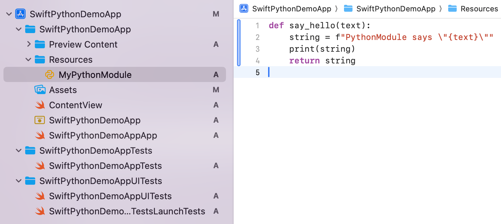
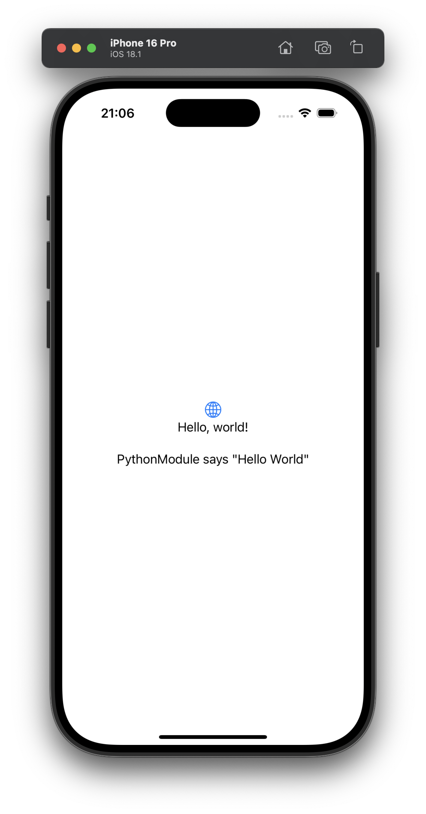

# SwiftPython – The easiest way to integrate Python into iOS applications
SwiftPython makes it easy to integrate Python into iOS applications, simply by including this Swift package as a dependency. The package enables Swift apps to start an embedded Python interpreter, execute Python functions and custom scripts, and receive their output directly in Swift. 

Features:
1. Includes a pre-built Python library that embeds a Python interpreter directly into iOS applications.
2. Built-in support for popular Python packages, including NumPy and pandas.
3. Interaction between Swift and Python via PythonKit.
4. We provide a build script for customizing the Python library with additional packages, if required (see below).

**The default version is Python 3.10.**

## Installation
As with any other Swift package, simply include the path to this repository as dependency in the Swift package manager:

``` sh
https://github.com/RealLast/SwiftPython
```

Alternatively, include the package using SPM:
``` swift
import PackageDescription

let package = Package(
    name: "YourProject",
    dependencies: [
        .package(url: "https://github.com/RealLast/SwiftPython", branch: "master")
    ],
    targets: [
        .target(
            name: "YourProject",
            dependencies: ["SwiftPython"])
    ]
)
```

## Usage
> **You can find a demo application under [DemoApp/SwiftPythonDemoApp](DemoApp/SwiftPythonDemoApp/)**

Create a Python File, e.g., "MyPythonModule.py":
``` python
def say_hello(text):
    string = f"PythonModule says \"{text}\""
    print(string)
    return string
```

Place it under Resources:



In your Swift code, you can import SwiftPython and start the Python Interpreter. Afterward you can import your module and call any functions or instantiate classes defined in the python code:
``` python
SwiftPython.startPythonInterpreter()
let myModule = Python.import("MyPythonModule")
let result = myModule.say_hello("Hello World")
```

You can even use the output of your Python function in a SwiftUI view:

``` swift
import SwiftUI
import SwiftPython
import PythonKit
@main
struct SwiftPythonDemoAppApp: App {
    
    var pythonText = ""
    var body: some Scene {
        WindowGroup {
            ContentView()
            Text(pythonText)
        }
    }
    
    init() {
        SwiftPython.startPythonInterpreter()
        
        let myModule = Python.import("MyPythonModule")
        let result = myModule.say_hello("Hello World")
        pythonText = "\(result)"
    }
    
    func printPythonVersion() {
        let sys = Python.import("sys")
        let text = ("Python \(sys.version_info.major).\(sys.version_info.minor)")
        print("Got Python version \(text)")
    }
}
```



## Supported python packages
The following packages are currently included by default:

- python stdlib (i.e., sys, path, os, ...)
- numpy
- pandas
- matplotlib

### How can I include further Python packages?
If you want to add more python packages, you need to build the Python binary from scratch (see below). The Python binary is built using [briefcase](https://beeware.org/project/briefcase/). It supports including Python packages from [pypi](https://pypi.org/). You can include any pip package as long as, either:
1. The package is python-only, which is true for most packages.
2. Or, the package is not python-only but is supported by briefcase, check here: [supported python packages with native components](https://anaconda.org/beeware/repo). 

To include further packages, check out the instructions below on how to build python binary (xcframework) from scratch:

## Building the python binary from scratch (to include more packages)

### 1. Installing dependencies:
Install briefcase:
``` sh
pip install beeware
```

### 2. Adding packages:
Open the file [pyproject.toml](https://github.com/RealLast/SwiftPython/blob/main/PythonFramework/compile/pythonframework/pyproject.toml#L24) under PythonFramework/compile/pythonframework.

Find the Line saying "Add your cross-platform app requirements here": 

``` toml
requires = [
    # Add your cross-platform app requirements here
    "numpy",
    "pandas",
    "matplotlib"
]
```

Add your required pip package. Make sure it fullfills the [requirements](#how-can-i-include-further-python-packages). For example, add CLAID:

``` toml
requires = [
    # Add your cross-platform app requirements here
    "numpy",
    "pandas",
    "matplotlib",
    "claid==0.6.4"
]
```

### 3. Building
Use make to build the package:
``` sh
make all
```

### 4. Updating the path to the framework:
In the [Package.swift](Package.swift) of this repository, you can find the following lines which include the prebuilt xcframework which we provide:

``` swift
.binaryTarget(
        name: "PythonFramework",
        url: "https://github.com/RealLast/SwiftPython/releases/download/v0.9/Python.xcframework.zip",
        checksum: "dadedc75985f60f803fa0077ed26bb15ca102de6c8628163735a83a57ef95839"
    ),
```

As you see, this points to our prebuilt binary hosted on GitHub. Since you just built an updated package locally, you need to change this statement to include your local xcframework:

``` swift
.binaryTarget(
    name: "PythonFramework",
    path: "PythonFramework/prebuilt/Python.xcframework"
),
```
